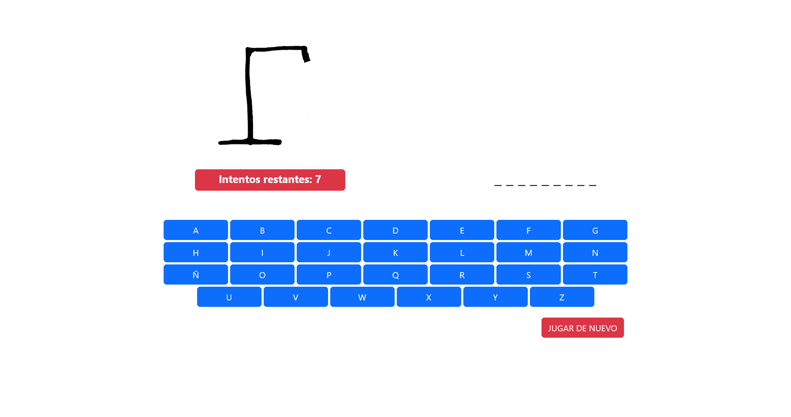
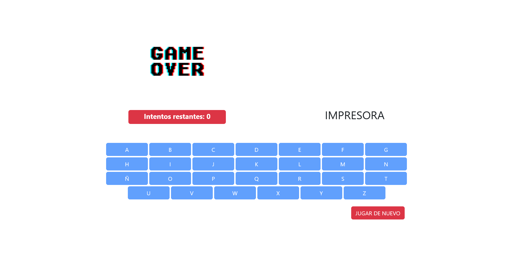

# Juego ahorcadito

Juego realizado con react js para la Facultad (Tecnicatura Universitaria en Diseño integral de videojuegos)
Esta es mi version de [ahorcado-Grupo3](https://github.com/AraMilagros/ahorcado-Grupo3) que se realizó de forma grupal.

-Si el proyecto se descarga/clona, para poder ejecutarlo primero se debera poner en consola:

# 'npm install'

y luego que se hayan descargado las dependencias necesarias: 

# 'npm start'

#Capturas

-Inicio del juego

-Game over

